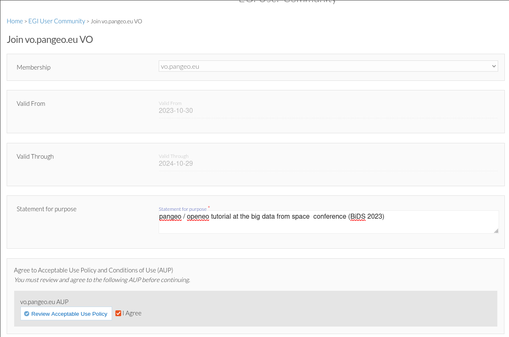
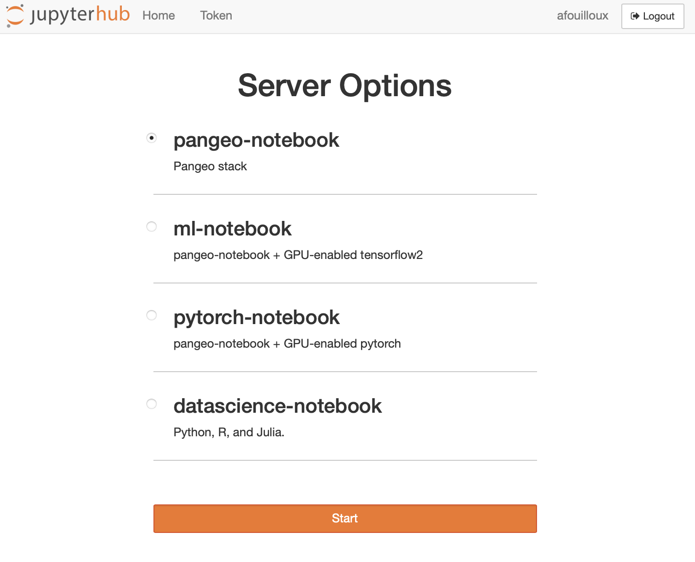
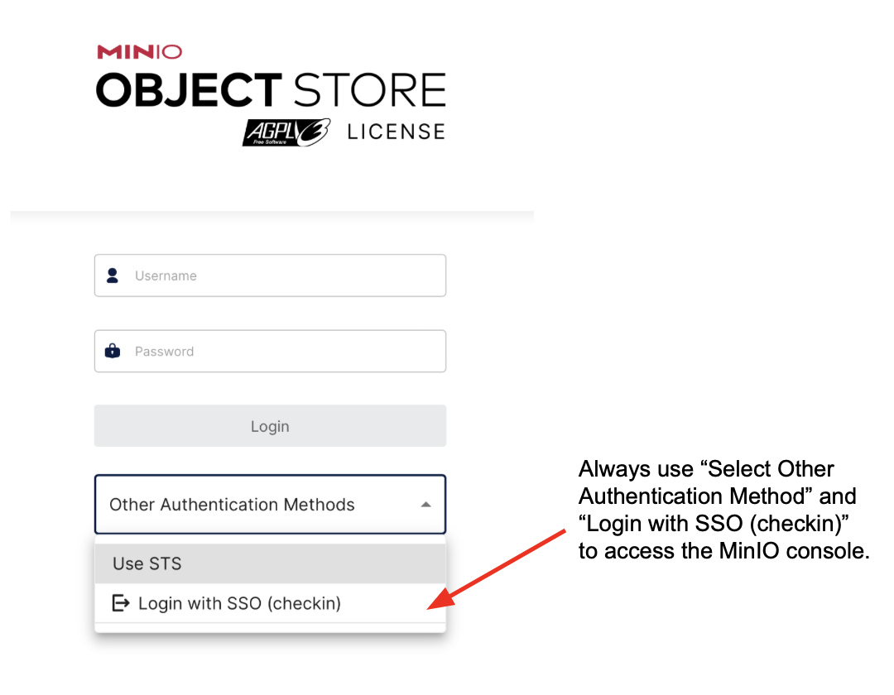

# Pangeo@EOSC

## Users: How to get access to `pangeo-eosc` services?

In this section you will learn how to register and access `pangeo-eosc` services.

### Registration

You need to create an [EGI Check-in account](https://www.egi.eu/service/check-in/) and enroll to the `vo.pangeo.eu` Virtual Organisation. There are several steps to follow:

1. Sign up for an EGI account on the **development instance** of EGI Check-In, clicking on: [https://aai-dev.egi.eu/registry/co_petitions/start/coef:2](https://aai-dev.egi.eu/registry/co_petitions/start/coef:2). **Use your [ORCID iD](https://orcid.org/) account to authenticate.**
2. **Enroll** in the `vo.pangeo.eu` Virtual Organisation (VO) by clicking on: [https://aai-dev.egi.eu/registry/co_petitions/start/coef:290](https://aai-dev.egi.eu/registry/co_petitions/start/coef:290). Review and click on `Submit`. Please add a note in the statement of purpose when requesting to join the VO explaining as "Pangeo / openeo tutorial at the BIDS23" as shown in the example. 

Managers of the Virtual Organisations may **take several days** to approve your petitions to join and also get back to you via email to verify your identity.

### Access DaskHub

Access DaskHub via [https://pangeo-eosc.vm.fedcloud.eu/](https://pangeo-eosc.vm.fedcloud.eu/) and choose among the 4 available flavors (as shown on the figure below):

- Pangeo Notebook uses a docker image maintained by the Pangeo community. It contains all the Python packages you need to data analysis and visualization. The list of packages and all the Pangeo Notebook environment is made available [here](https://github.com/pangeo-data/pangeo-docker-images); look up the `pangeo-notebook` folder. 
- Machine Learning Pangeo notebook with GPU enable tensorflow2: similarly, it is maintained by the Pangeo community and the complete computational environment with the list of Python packages is also available at [https://github.com/pangeo-data/pangeo-docker-images](https://github.com/pangeo-data/pangeo-docker-images) in the `ml-notebook` folder. This flavor contains all the packages from the Pangeo Notebook flavor and is GPU-enabled tensorflow2. Choose this flavor if you need GPUs; for instance for training neural networks;
- Machine Learning Pangeo notebook with GPU enable pytorch: it is the same as `ml-notebook` but with GPU-enabled pytorch.
- Datascience Notebook with Python, R and Julia is maintained by the Jupyter community at [https://github.com/jupyter/docker-stacks](https://github.com/jupyter/docker-stacks). Look up the `datascience-notebook` folder. It contains 3 different kernels, namely Python, R and Julia notebooks. Please note that you would probably need to add additional packages as the list of available packages is not exhaustive.

You need to click on `Sign in with EGI Check-in` and then use your ORCID iD credentials.

A [Dask Gateway](https://gateway.dask.org/) is available for scaling your computation. For more details on this deployment, you may want to take a look at [Daskhub helm chart](https://github.com/dask/helm-chart/tree/main/daskhub).

### Access MinIO

Each user has a very small amount of local storage when using the DaskHub as it is not meant to be used for storing large data.  Instead a dedicated [MinIO Object storage](https://min.io) has been setup.

The MinIO console endpoint is: [https://pangeo-eosc-minio.vm.fedcloud.eu/](https://pangeo-eosc-minio.vm.fedcloud.eu/). You can authenticate to the MinIO Object Storage in the same way you login to DaskHub. As shown on the Figure below, make sure you "Select Other Authentication Method" and "Login with SSO (checkin)" to access the MinIO console. Then use your ORCID iD to login.

You can create, access and manage your buckets from the minIO console (or use [minIO Python package](https://min.io/docs/minio/linux/developers/python/minio-py.html)). The figure below shows the GUI (with several tabs on the left; the bucket tab is selected on the figure): initially, you won't have any buckets so please feel free to create public/privates buckets.

In addition to the MinIO console, the API end point is `https://pangeo-eosc-minioapi.vm.fedcloud.eu/` for those who prefer to interact with MinIO via the API.

Please check out this [example](./how-to/object-storage-minio-test.ipynb) to get started.

### Support

If you need support, please open an [issue](https://github.com/pangeo-data/pangeo-eosc/issues).

### Monitoring

Check out the [open grafana dashboard](https://kuba-mon.cloud.e-infra.cz/d/vd9rFCL4z/c-scale?orgId=1&refresh=30s). It is particularly useful to check that there are GPUs available before requesting an environment with GPU.

## Weekly coffee meetings

Join the Pangeo community in Europe in a weekly call every Tuesday at 9.30am CET/CEST at: https://meet.jit.si/pangeo-europe

Attend the meeting not only to get to know each other but also to ask questions about how to use the Pangeo ecosystem.

## Background information

Let's start with a bit of background information! The cloud resources for pangeo-eosc are provided through the collaboration between the [Pangeo community](https://pangeo.io), the [EGI-ACE project](https://www.egi.eu/project/egi-ace/), and the [C-SCALE project](https://c-scale.eu) within the [European Open Science Cloud](https://eosc-portal.eu/about/eosc) framework.

## The European Open Science Cloud (EOSC)

The [European Open Science Cloud (EOSC)](https://eosc-portal.eu/about/eosc) aims at becoming the main environment for hosting and processing research data to support European Science. 

### Pangeo Europe 

[Pangeo](https://pangeo.io/) is a worldwide community for Big Data geoscience promoting open, reproducible, and scalable science. 

[Pangeo Europe](https://pangeo.io/meeting-notes.html) aims at highlighting European contributions to the Pangeo Community and at providing a reference deployment for Pangeo on EOSC. The Pangeo deployment on EOSC has been made possible thanks to [CESNET](https://www.cesnet.cz/?lang=en) in the context of the the [EGI-ACE project](https://youtu.be/Vc9SZNa2-Os) and the [C-SCALE project](https://youtu.be/-jBkR_2_vg8).
