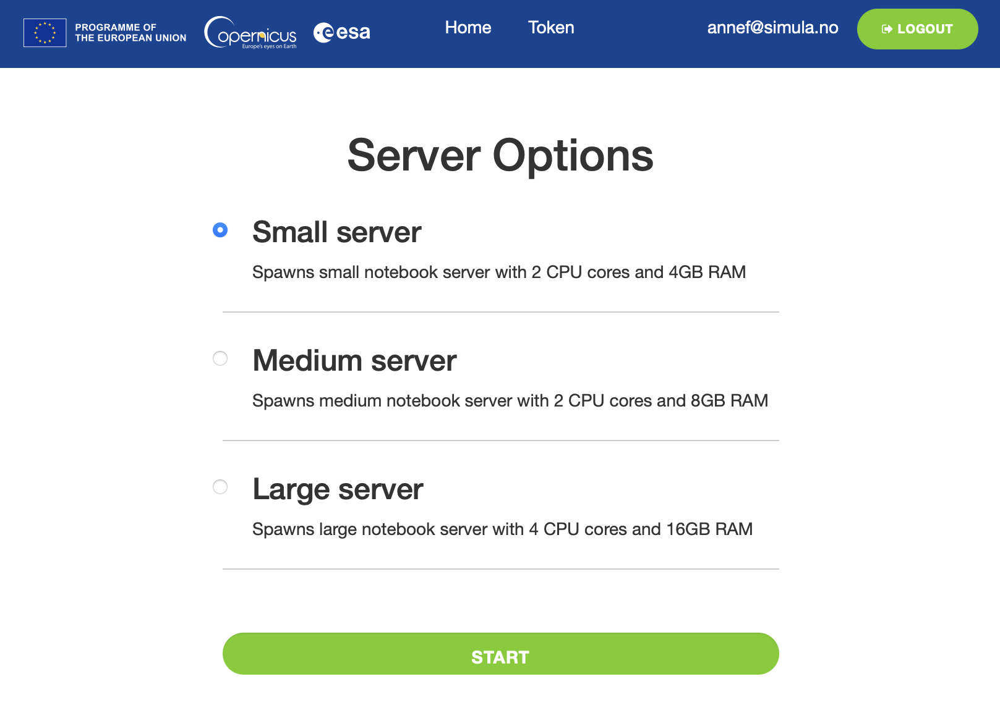

# Copernicus Data Space Ecosystem

[The Copernicus Data Space Ecosystem](https://dataspace.copernicus.eu) is a data infrastructure for accessing and analyzing Sentinel satellite imagery. Most of the Pangeo & OpenEO training materials can be executed using the Jupyter Notebooks in the Copernicus Dataspace ecosystem.

## Registration

If you do not have an account yet, register [here](https://identity.dataspace.copernicus.eu/auth/realms/CDSE/protocol/openid-connect/auth?client_id=cdse-public&response_type=code&scope=openid&redirect_uri=https%3A//dataspace.copernicus.eu/account/confirmed/333) to create a new account.

Click on the **REGISTER** Button and fill all the reguired fields to create a new account.

## Getting access to Copernicus Jupyter Notebooks

To access the Copernicus Jupyter Notebook JupyterHub, you need to login at [https://jupyterhub.dataspace.copernicus.eu/hub/spawn](https://jupyterhub.dataspace.copernicus.eu/hub/spawn).

Then you can choose among the 3 available flavors (as shown on the figure below):

For the tutorial, we suggest you use the "Large Server".

